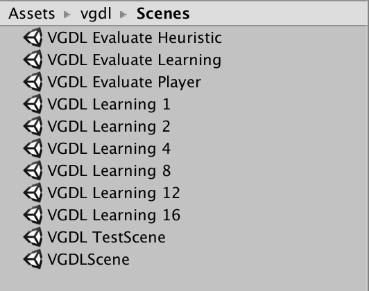
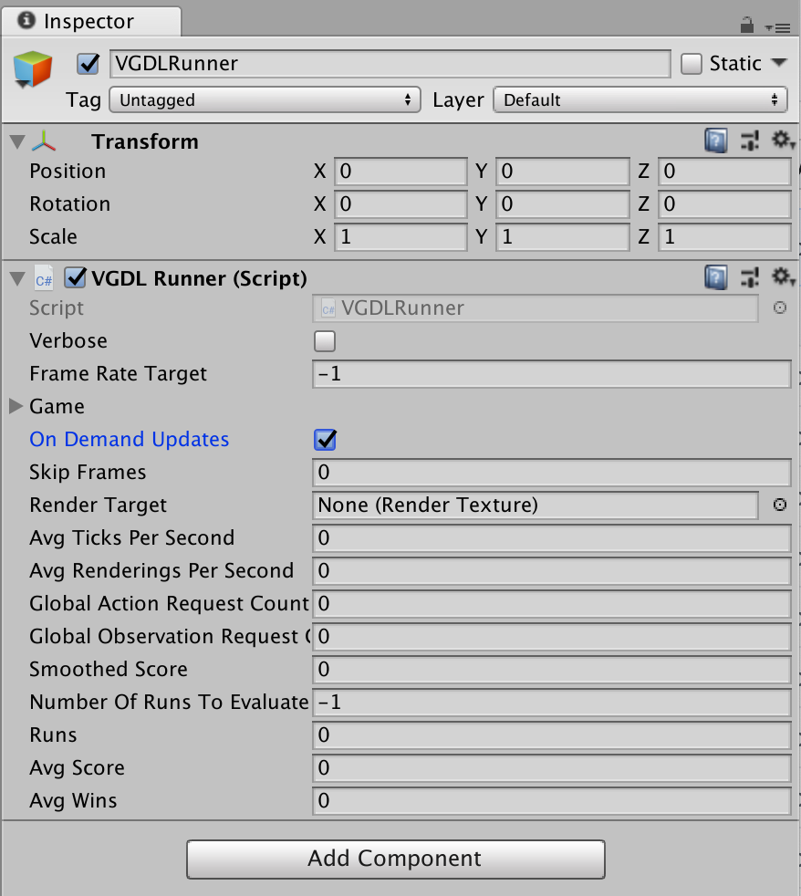
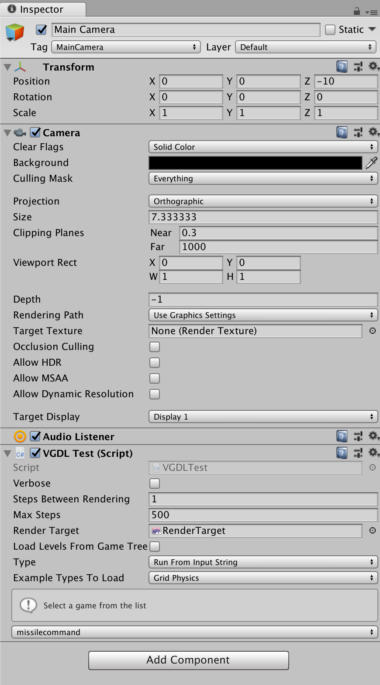
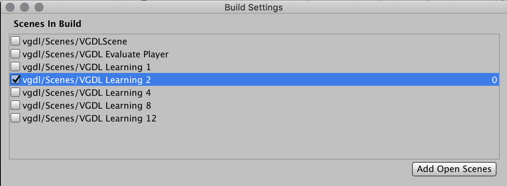

# Using the UnityVGDL Framework

## Scenes

_UnityVGDL_ provides a list of scenes, for various purposes.

#### Learning Scenes

The learning scenes are setup to be used for [training](https://github.com/Unity-Technologies/ml-agents/blob/master/docs/Training-ML-Agents.md), they can be used either directly from the editor or built into executables and used as [learning environments](https://github.com/Unity-Technologies/ml-agents/blob/master/docs/Learning-Environment-Design.md).

###### VGDL Learning 1, 2, 4, 8, 12, 16

The scenes are setup with 1, 2, 4, 8, 12 and 16 game instances respectively. The ML-Agents python interface can create multiple environment instances (executables), to take advantage of multiple cores when training. To optimally exploit the CPU cores, use a learning scene that uses around 100% of one core, and then use the ML-Agents python interface to spawn an environment for each availble core.

#### Evaluation Scenes

The evaluation scenes can be used to play vgdl games, as a Player (_VGDL Evaluate Player_), with scripted behavior (_VGDL Evaluate Heuristic_) or using a trained brain with inference (_VGDL Evaluate Learning_).

### Setting up the scenes

As a general rule in every scene you have to change which VGDL game(s) to use. This is setup on the **VGDL Academy** for all scenes except the test scene.

#### VGDL Academy

The _VGDL Academy_ extends the [ML-Agent Academy](https://github.com/Unity-Technologies/ml-agents/blob/master/docs/Learning-Environment-Design-Academy.md), they control the _VGDL Agent_ instantiation, and the list of games used for training/playing. 

In any scene used for training, each brain to train is listed in the _Broadcast Hub_ default is set to the _VGDLLearning84x84_ Brain, that takes a visual 84x84 renderTexture as input and outputs the discrete action space [**LEFT, RIGHT, UP, DOWN, USE, NIL**]. 

In case of training the _Control_ checkmark has to be on, allowing the ml-agent python interface pipeline to work. 

In the evaluation scenes, the _Control_ checkmark is off, which allows the Academy to setup inference of a trained brain.

##### VGDL games/levels to train on

This section of the VGDLAcademy controls the game(s) used for playing/training in the scene.

_Random Order_ determines if the order of the listed game(s)/level(s) should be shuffled.

_Current Index_ show which game(s)/level(s) is begin used for training from the curriculum.

_Current Repetition_ is used to determine when procede to a new game/level, based on the _Min Lesson Length_ of each element in the _Curriculum_.

The curriculum is a partically implemented version of the [ml-agents curriculum settings](https://github.com/Unity-Technologies/ml-agents/blob/master/docs/Training-Curriculum-Learning.md). The system is not integrated with the curriculum learning in ml-agents.

###### Elements in the Curriculum consists of the following

_Type_ is game type [__Grid Physics, Continuous Physics, *Two-Player*__]. (Two-Player games current not fully implemented)

_Filename_ is the game to load, from the selected examples _Type_ folder, gonna be changed to a dropdown soon.

_Level_ the level index to load, [__0 to 4__].

~~Use Reward Measure~~ curently unused

_Min Lesson Length_ how many times should the game/level be repeated before a new game/level is selected.

~~Threshold~~ curently unused

~~Signal Smoothing~~ curently unused

#### VGDL Agent

The _VGDLAgent_ is setup to use visual observations using render textures. Using the _Image_ reference the render texture is added to a UI element, for debug visualization.

The learning scenes have _Max Step_ set to 1500 (a timeout limit also present in some VGDL descriptions).

_Reset On Done_ is on, which means the VGDL game is reset by the _VGDLAgent_, the game will not restart after it ends, unless this is on.

_On Demand Descisions_ should be disabled

_Descision Interval_ functions like "skip frames", observations will only be collected with this interval, actions repeat between observations.

_Step Reward_ can be used to provide a reward at each step, such as a small negative reward, to encurage agent to explore the state space more.

##### VGDL Runner

_Verbose_ logs every step in the parsing and execution of a VGDL game.

_Frame Rate Target_ used for limiting the execution speed. Default values are -1 (unlimited) and 20 (standard in GVGAI)

_On Demand Updates_ when this is set, the VGDL game updates will be based on the VGDLAcademy updates. When it is disabled the Rendering and VGDL game updates are based on the Unity MonoBehavior Update and OnGUI / OnPostRender functions

_Skip Frames_ unused

_Render Target_ the render texture used to render the game.

_Number of Runs To Evaluate_ Once this number is reached, the runner stops updating the VGDL Game. Default -1 (unlimited)

The rest of the values function as debug info.

### VGDL Test Scene

The VGDL Test Scene was used heavily during development, it parses (and runs) either one or more VGDL games from the examples.

The VGDL Test script component is located on the main camera game object. The test script will parse and run games with a Random agent controlling the avatar.

_Verbose_ logs every step in the parsing and execution of a VGDL game.

_Steps Between Rendering_ number of game updates between rendering to the screen (speeds up tests).

_Max Steps_ a update limit before continuing to the next level/game.

_Render Target_ render texture to render to.

_Load Levels From Game Tree_ a subtle new feature for VGDL, implemented in the VGDL Parser of __UnityVGDL__. This feature allows a VGDL level descriptions to be nested inside the game description file. Example can be seen in the Tooltip of this field (or in the code). This feature will be automated in the future (meaning the parser will just look for the Levels set and automatically load levels from game tree).

_Type_ is the test type [__Parse From Input String, Run From Input String__] parses (and runs) a single game and all its levels, [__Parser Test, Parse and Run Test__] parses (and runs) every game and level of the selected example type.

_Example Types to Load_ is game type [__Grid Physics, Continuous Physics, *Two-Player*__]. (Two-Player games current not fully implemented)

_Select a game from the list_ is a dropdown, showing all games of the selected example type in the examples folder. Only appears when test type is set to [__Parse From Input String, Run From Input String__].

## Building an Executable

To [build an executable](https://docs.unity3d.com/Manual/PublishingBuilds.html) you follow the normal Unity Build steps. However you have to make sure only the scene you're trying to build is selected in the _Build Settings_. If you don't see the current scene in your _Scenes In Build_ click the _Add Open Scenes_ button.

Once the executable has been built, you can use it with the ml-agents python interface by setting the _'env'_ parameter on the trainer.

